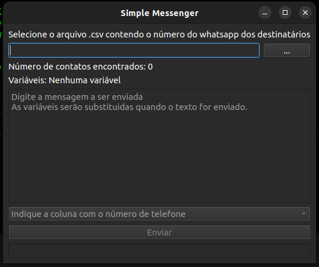

# Simple Messenger

A simple application written in Python to send whatsapp text messengers to a list of users




### INSTALL

1. Download/Clone from Github
2. Execute the following commands:

#### Windows
```bash
python -m venv .
Scripts\activate.bat
pip3 install -r requirements.txt
```
#### Linux
```bash
python3 -m venv .
source bin/activate
pip3 install -r requirements.txt
```

### USAGE

1. In a virtual environment*, execute `python ui.py` (Windows) / `python3 ui.py` (Linux).
2. Select a sheet that contains the target numbers. The file must be in CSV format and can be selected through the "..." button.
3. Write a text. Note: You can use the data in the sheet in your text. For example, "$name, welcome!". If there is a "name" column in the sheet, the value of the row will be replaced.
4. Indicate which column contains the phone numbers.
5. Press the send button.

* Windows: "Scripts\activate.bat"
* Linux: "source bin/activate"
